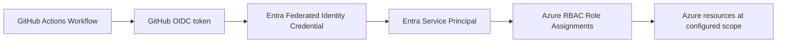

# waterapps-azure-bootstrap

Terraform bootstrap for GitHub Actions OIDC access into Azure using Entra ID federated credentials and baseline RBAC assignments.

## Public Reference Notice

This repository is a generalized reference implementation for Azure CI/CD bootstrap patterns. Environment-specific values and sensitive operational details should remain private.

## Repository Metadata

- Standard name: `waterapps-10-bootstrap-oidc-rbac-azure`
- Depends on: none
- Provides: GitHub OIDC bootstrap + Azure RBAC baseline for downstream repo CI/CD
- Deploy order: `10`

## Scope (starter scaffold)

- Entra ID application registration + service principal
- Federated identity credentials for GitHub Actions subjects (branch / pull request / environment)
- Subscription/resource-group scoped RBAC assignments
- Outputs for downstream GitHub repo configuration

## What this MVP now creates

| Resource / object | Purpose |
| --- | --- |
| Entra application registration | Identity used by GitHub Actions OIDC login |
| Entra service principal | Principal assigned Azure RBAC roles |
| Federated identity credentials | Trusts GitHub OIDC subjects for selected repos |
| Azure RBAC role assignments | Baseline access at subscription/resource-group scopes |

## OIDC Subject Patterns (GitHub Actions)

This repo can create federated credentials for:

- `repo:ORG/REPO:ref:refs/heads/main` (or configured default branch)
- `repo:ORG/REPO:pull_request`
- `repo:ORG/REPO:environment:production` (via `github_environment_subjects`)

## Bootstrap Flow (Mermaid)



## Quickstart (first local bootstrap)

Create `terraform/terraform.tfvars` (example shown in `docs/bootstrap-sequence.md`), then:

```bash
cd terraform
terraform init
terraform plan
terraform apply
```

The first apply is usually local because the GitHub OIDC trust does not exist yet.

## GitHub Actions configuration (after apply)

Populate the downstream repo (or environment) with:

- Secret: `AZURE_CLIENT_ID`
- Variable: `AZURE_TENANT_ID`
- Variable: `AZURE_SUBSCRIPTION_ID`

These match the provided `apply.yml` workflow.

## CI/CD status

- `.github/workflows/terraform-ci.yml` runs `terraform fmt`, `init -backend=false`, and `validate`
- `.github/workflows/apply.yml` supports manual `plan` or `apply` using Azure OIDC login

## Structure

```text
terraform/
  main.tf        # Entra app/SP + federated credentials + RBAC assignments
  variables.tf   # GitHub repos/subjects, scopes, roles, tenant/subscription inputs
  outputs.tf     # Client IDs, subject map, RBAC plan summary
docs/
  bootstrap-sequence.md   # Local-first bootstrap and post-bootstrap workflow setup
.github/workflows/
  terraform-ci.yml        # fmt/init/validate checks
  apply.yml               # manual plan/apply via Azure OIDC
```
